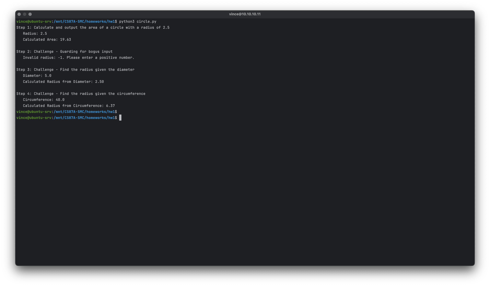
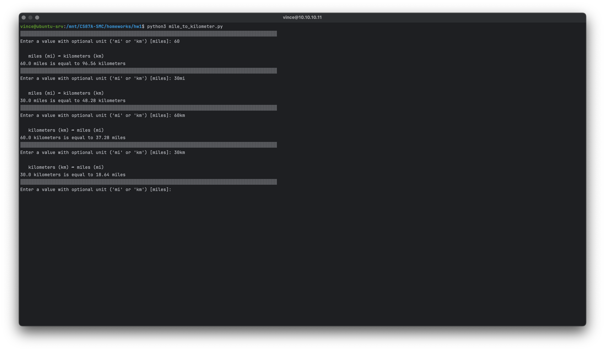
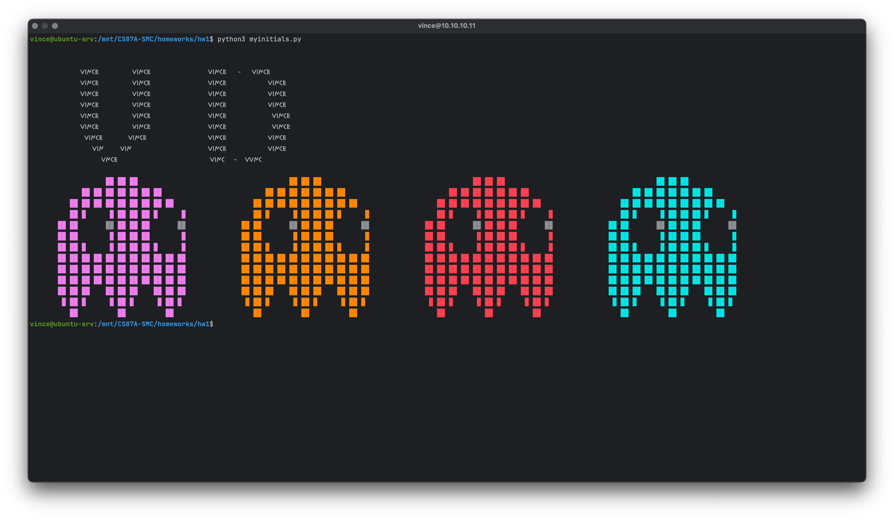
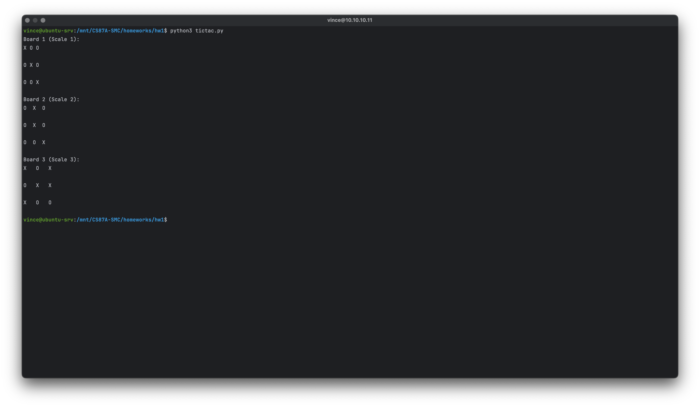
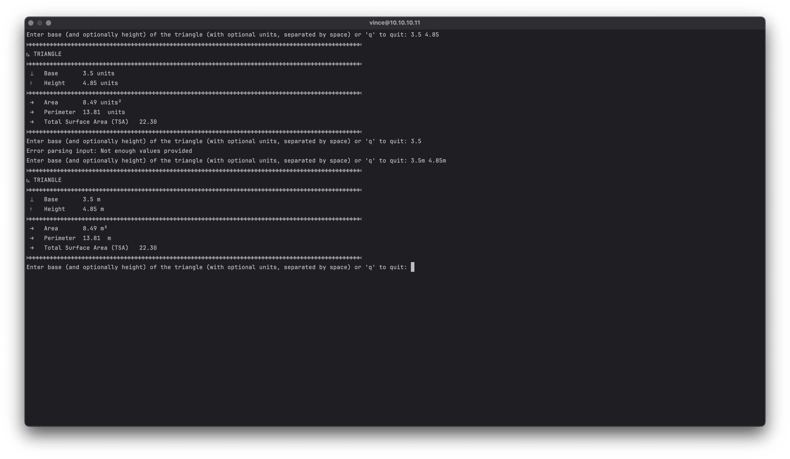
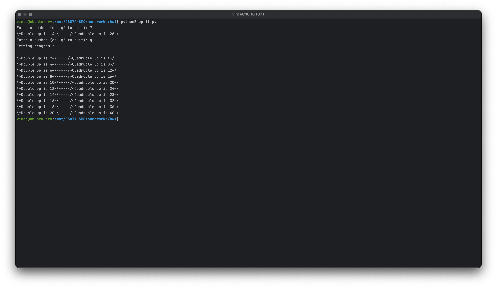

## Table of Contents

1. [circle.py](#circle.py)
2. [mile_to_kilometer.py](#mile_to_kilometer.py)
3. [myinitials.py](#myinitials.py)
4. [tictac.py](#tictac.py)
5. [triangle.py](#triangle.py)
6. [up_it.py](#up_it.py)

### circle.py

```python
"""
Vincent de Torres
CS87A-Summer 2024 

This module provides functions to perform calculations related to circles:

- calculate_area(radius): Calculate the area of a circle given its radius.
- validate_input(value): Validate that the input value is a positive number.
- calculate_radius_from_diameter(diameter): Calculate the radius of a circle given its diameter.
- calculate_radius_from_circumference(circumference): Calculate the radius of a circle given its circumference.

Constants:
- PI: Mathematical constant π.

The module includes a main function demonstrating the usage of these functions with examples.
"""

import math

# Constants
PI = math.pi

# Function to calculate the area of a circle given its radius
def calculate_area(radius):
    """
    Calculate the area of a circle given its radius.
    """
    area = PI * (radius ** 2)
    return area

# Function to validate the input
def validate_input(value):
    """
    Validate that the input is a positive number.
    """
    return value > 0

# Function to calculate the radius from the diameter
def calculate_radius_from_diameter(diameter):
    """
    Calculate the radius of a circle given its diameter
    """
    radius = diameter / 2
    return radius

# Function to calculate the radius from the circumference
def calculate_radius_from_circumference(circumference):
    """
    Calculate the radius of a circle given its circumference.
    """
    radius = circumference / (2 * PI)
    return radius

def main():
    # Step 1: Define radius and calculate area
    print("Step 1: Calculate and output the area of a circle with a radius of 2.5")
    radius = 2.5
    area = calculate_area(radius)
    print(f"   Radius: {radius}")
    print(f"   Calculated Area: {area:.2f}")

    # Step 2: Handle bogus input for radius
    print("\nStep 2: Challenge - Guarding for bogus input")
    invalid_radius = -1
    if validate_input(invalid_radius):
        area = calculate_area(invalid_radius)
        print(f"   Radius: {invalid_radius}")
        print(f"   Calculated Area: {area:.2f}")
    else:
        print(f"   Invalid radius: {invalid_radius}. Please enter a positive number.")

    # Step 3: Calculate and output radius from diameter
    print("\nStep 3: Challenge - Find the radius given the diameter")
    diameter = 5.0
    radius_from_diameter = calculate_radius_from_diameter(diameter)
    print(f"   Diameter: {diameter}")
    print(f"   Calculated Radius from Diameter: {radius_from_diameter:.2f}")

    # Step 4: Calculate and output radius from circumference
    print("\nStep 4: Challenge - Find the radius given the circumference")
    circumference = 40.0
    radius_from_circumference = calculate_radius_from_circumference(circumference)
    print(f"   Circumference: {circumference}")
    print(f"   Calculated Radius from Circumference: {radius_from_circumference:.2f}")

if __name__ == "__main__":
    main()
```



### mile_to_kilometer.py

```python
"""
Vincent de Torres
CS87A-Summer 2024 

Functions:
- parse_input(input_str): Parses the input string to extract the value and unit ('mi' or 'km').
- miles_to_kilometers(value): Converts miles to kilometers.
- kilometers_to_miles(value): Converts kilometers to miles.
- print_line(): Prints a line separator.
- main(): Main function to prompt user input for a distance value and unit, 
          perform conversion using the appropriate function, and display the results.
"""

def parse_input(input_str):
    """
    Parses the input string to extract the value and unit, assuming 'mi' if no unit is specified.

    Args:
    - input_str (str): Input string containing value with optional unit ('mi' or 'km').

    Returns:
    - tuple: A tuple containing (value, unit).
             If parsing fails, returns (None, None).
    """
    try:
        # Check if the input string ends with 'mi' or 'km'
        if input_str.lower().endswith('mi' or ' mi') or input_str.lower().endswith('km' or ' km'):
            unit = input_str[-2:].lower()
            value_str = input_str[:-2].strip()
        else:
            # Assume 'mi' as the default unit if no unit is specified explicitly
            value_str = input_str.strip()
            unit = 'mi'  # Default unit is miles if not specified

        value = float(value_str)

        if unit not in ['mi', 'km']:
            raise ValueError(f"Invalid unit: {unit}")

        return value, unit

    except (ValueError, IndexError) as ve:
        print(f"Error parsing input: {ve}")
        return None, None


def miles_to_kilometers(value):
    """
    Converts miles to kilometers.

    Args:
    - value (float): Value in miles to convert to kilometers.

    Returns:
    - float: Value converted to kilometers.
    """
    return value * 1.60934


def kilometers_to_miles(value):
    """
    Converts kilometers to miles.

    Args:
    - value (float): Value in kilometers to convert to miles.

    Returns:
    - float: Value converted to miles.
    """
    return value / 1.60934

def print_line():
    """
    Prints a line separator.
    """
    print('░' * 95)

def main():
    """
    Main function to prompt user input for a distance value and unit, 
    perform conversion using the appropriate function, and display the results.
    """
    from_val = 'miles (mi)'
    to_val = 'kilometers (km)'
    while True:
        print_line()

        input_str = input("Enter a value with optional unit ('mi' or 'km') [miles]: ")
        value, unit = parse_input(input_str)

        if value is None or unit is None:
            print("Exiting...")
            break

        if unit == 'mi':
            print(f"\n   {from_val} ➦ {to_val} ")
            kilometers = miles_to_kilometers(value)
            print(f"{value} miles is equal to {kilometers:.2f} kilometers")
        elif unit == 'km':
            from_val = 'kilometers (km)'
            to_val = 'miles (mi)'
            print(f"\n   {from_val} ➦ {to_val} ")
            miles = kilometers_to_miles(value)
            print(f"{value} kilometers is equal to {miles:.2f} miles")

if __name__ == "__main__":
    main()
```



### myinitials.py

```python
"""
Vincent de Torres
CS87A-Summer 2024

Functions:
- print_initials(): Prints a decorative initials pattern.
- modify_grid(grid, color): Modifies the grid by replacing characters and adding color escape sequences.
- animate(grid, colors): Animates the grid with changing colors.
- combine_lines(grid, colors): Combines each line in the grid with all color variations into a single line.
- clear(): Clears the terminal screen
"""
import time,os
def print_initials():
    print("\n")

    print("\t  𐌖𐌉𐌍𐌂𐌄   𐌖𐌉𐌍𐌂𐌄 \t  𐌖𐌉𐌍𐌂𐌄-𐌖𐌉𐌍𐌂𐌄")
    print("\t  𐌖𐌉𐌍𐌂𐌄   𐌖𐌉𐌍𐌂𐌄 \t  𐌖𐌉𐌍𐌂𐌄     𐌖𐌉𐌍𐌂𐌄")
    print("\t  𐌖𐌉𐌍𐌂𐌄   𐌖𐌉𐌍𐌂𐌄 \t  𐌖𐌉𐌍𐌂𐌄     𐌖𐌉𐌍𐌂𐌄")
    print("\t  𐌖𐌉𐌍𐌂𐌄   𐌖𐌉𐌍𐌂𐌄 \t  𐌖𐌉𐌍𐌂𐌄     𐌖𐌉𐌍𐌂𐌄")
    print("\t  𐌖𐌉𐌍𐌂𐌄   𐌖𐌉𐌍𐌂𐌄 \t  𐌖𐌉𐌍𐌂𐌄      𐌖𐌉𐌍𐌂𐌄 ")
    print("\t  𐌖𐌉𐌍𐌂𐌄   𐌖𐌉𐌍𐌂𐌄  \t  𐌖𐌉𐌍𐌂𐌄      𐌖𐌉𐌍𐌂𐌄   ")
    print("\t   𐌖𐌉𐌍𐌂𐌄 𐌖𐌉𐌍𐌂𐌄 \t  𐌖𐌉𐌍𐌂𐌄     𐌖𐌉𐌍𐌂𐌄 ")
    print("\t      𐌖𐌉𐌍 𐌖𐌉𐌍  \t\t  𐌖𐌉𐌍𐌂𐌄     𐌖𐌉𐌍𐌂𐌄  ")
    print("\t        𐌖𐌍𐌂𐌄   \t\t   𐌖𐌉𐌍𐌂-𐌖𐌖𐌍𐌂  \n")

def modify_grid(grid, color):
    """
    Modify the grid by replacing characters and adding color escape sequences.

    Parameters:
    - grid (list of str): List containing strings representing each line of the grid.
    - color (str): ANSI escape sequence for color.

    Returns:
    - list of str: Modified grid with characters replaced and colored.
    """
    modified_grid = []
    for line in grid:
        modified_line = ''
        for char in line:
            if char == '█':
                modified_line += f"{color} \033[0m"
            elif char == '░':
                modified_line += f"{color}█\033[0m"
            elif char == '▒▒':
                modified_line += f"{color}▒▒\033[0m"
            else:
                modified_line += char
        modified_grid.append(modified_line)
    return modified_grid

def animate(grid,colors):
    # Animation loop
    for color in colors:
        modified_grid = modify_grid(grid, color)
        for offset in range(10):
            clear()

            if offset % 2 == 1:
                print('')
            elif offset % 3 == 2:
                print('')
                print('')

            for line in modified_grid:
                print(f'\t' * offset + line)
            time.sleep(0.3)
def combine_lines(grid, colors):
    """
    Combine each line in the grid with all color variations into a single line.

    Parameters:
    - grid (list of str): List containing strings representing each line of the grid.
    - colors (list of str): List of ANSI escape sequences for colors.

    Returns:
    - list of str: Combined grid variations with characters replaced and colored.
    """
    combined_grid = []
    for line in grid:
        combined_line = ''
        for color in colors:
            modified_line = modify_grid([line], color)[0]  # Apply color modification to the line
            combined_line += modified_line  # Concatenate modified line
        combined_grid.append(combined_line)
    return combined_grid

def clear():
    os.system('cls' if os.name == 'nt' else 'clear')


if __name__ == "__main__":
    grid = [
        "                   ░░ ░░ ░░                   ",
        "             ░░ ░░ ░░ ░░ ░░ ░░ ░░             ",
        "          ░░ ░░ ░░ ░░ ░░ ░░ ░░ ░░ ░░          ",
        "          ░░ ░█ ██ █░ ░░ ░░ ░░ ░█ ██ █░       ",
        "       ░░ ░░ ██ ██ ▒▒ ░░ ░░ ░░ ██ ██ ▒▒       ",
        "       ░░ ░░ ██ ██ █░ ░░ ░░ ░░ ██ ██ █░       ",
        "       ░░ ░░ ░█ ██ █░ ░░ ░░ ░░ ░█ ██ █░       ",
        "       ░░ ░░ ░░ ░░ ░░ ░░ ░░ ░░ ░░ ░░ ░░       ",
        "       ░░ ░░ ░░ ░░ ░░ ░░ ░░ ░░ ░░ ░░ ░░       ",
        "       ░░ ░░ ░░ ░░ ░░ ░░ ░░ ░░ ░░ ░░ ░░       ",
        "       ░░ ░░ ░░    ░░ ░░ ░░    ░░ ░░ ░░       ",
        "        ░ ░░ ░      ░ ░░ ░      ░ ░░ ░        ",
        "          ░░          ░░          ░░          ",
    ]


    colors = [
        '\033[95m',   # Pink
        '\033[38;5;208m',  # Orange
        '\033[91m',   # Red
        '\033[96m'    # Cyan
    ]

    print_initials()


    # combined_grid = combine_lines(grid, colors)
    # for line in combined_grid:
    #     print(line)

    animate(grid,colors)
```



### tictac.py

```python
"""
 Vincent de Torres
CS87A-Summer 2024 

This program demonstrates printing tic-tac-toe boards with scaled spacing between characters.

Functions:
- print_tic_tac_toe_board(board, scale): Print a tic-tac-toe board with scaled spacing between characters.

"""

def print_tic_tac_toe_board(board, scale):
    """
    Print a tic-tac-toe board with scaled spacing between characters.
    
    Args:
    - board (list of lists): The tic-tac-toe board represented as a 2D list of characters ('X', 'O', or other).
    - scale (int): The scaling factor for spacing between characters.
    """
    size = len(board)
    for i in range(size):
        row_str = ''
        for j in range(size):
            # Use 'X' and 'O' for the board representation
            row_str += board[i][j] + ' ' * scale
        print(row_str.rstrip())
        if i < size - 1:
            print(' ' * (size * scale))  # Extra spaces between rows
    print()

def main():
    # Define the tic-tac-toe boards with different winning combinations
    boards = [
        # Winning combination 1: Diagonal from top-left to bottom-right
        [
            ['X', 'O', 'O'],
            ['O', 'X', 'O'],
            ['O', 'O', 'X']
        ],
        # Winning combination 2: Vertical win
        [
            ['O', 'X', 'O'],
            ['O', 'X', 'O'],
            ['O', 'O', 'X']
        ],
        # Winning combination 3: Horizontal win
        [
            ['X', 'O', 'X'],
            ['O', 'X', 'X'],
            ['X', 'O', 'O']
        ]
    ]

    # Define the scales for spacing between characters
    scales = [1, 2, 3]  # Adjust as needed for spacing

    # Print each board with increasing spacing
    for i, board in enumerate(boards):
        scale = scales[i]
        print(f"Board {i + 1} (Scale {scale}):")
        print_tic_tac_toe_board(board, scale)

if __name__ == "__main__":
    main()
```



### triangle.py

```python
"""
Vincent de Torres
CS87A-Summer 2024 | HW1

Functions:
- prompt_for_base(): Prompt user for the base of the triangle input.
- prompt_for_triangle_input(): Prompt user for triangle dimensions (base and height) with optional units.
- prompt_for_height(base_value, base_unit): Prompt user for the height of the triangle, optionally specifying units.
- parse_input(input_str): Parse user input to extract base and height values with optional units.
- validate_input(base_value, height_value): Validate that both base and height values are positive.
- calculate_triangle_area(base, height): Calculate the area of the triangle given base and height.
- calculate_triangle_perimeter(base, height): Calculate the perimeter of the triangle given base and height.
- calculate_total_surface_area(area, perimeter): Calculate the total surface area of the triangle.
- exit_program(): Exit the program gracefully.
- print_line(): Print a decorative line for visual separation in output.
- main(): Main function to orchestrate the calculation and display of triangle properties.

"""

import math
import os


def prompt_for_base():
    """
    Prompt user for the base of the triangle input.
    
    Returns:
    - base_value (float): The base length of the triangle.
    - base_unit (str or None): The optional unit of measurement for the base.
    """
    while True:
        base_str = input("Enter base of the triangle: ")
        try:
            base_value = float(base_str)
            return base_value, None  # No unit provided initially
        except ValueError:
            print("Oops, something went acute! Enter the base as a number, please.")


def prompt_for_triangle_input():
    """
    Prompt user for triangle dimensions (base and height) with optional units.
    
    Returns:
    - base_value (float): The base length of the triangle.
    - base_unit (str or None): The optional unit of measurement for the base.
    - height_value (float): The height of the triangle.
    - height_unit (str or None): The optional unit of measurement for the height.
    """
    while True:
        input_str = input(
            "Enter base (and optionally height) of the triangle (with optional units, separated by space) or 'q' to quit: ")

        if input_str.lower() == 'q':
            exit_program()

        base_value, base_unit, height_value, height_unit = parse_input(input_str)
        if base_value is None:
            continue

        if base_unit and height_unit and base_unit.strip().lower() != height_unit.strip().lower():
            print(
                'Warning: Inputs do not have the same units of measurement. Please verify your input or perform conversions for accurate results.')

        if height_value is not None:
            if base_unit and height_unit and base_unit.strip().lower() != height_unit.strip().lower():
                confirm = input(
                    f"Units for base ({base_unit}) and height ({height_unit}) are different. Continue? (Y/N): ")
                if confirm.lower() != 'y':
                    continue

            return base_value, base_unit, height_value, height_unit

        confirm = input(f"Is {base_value} {base_unit if base_unit else 'units'} the base? (Y/N): ")
        if confirm.lower() == 'y':
            height_value, height_unit = prompt_for_height(base_value, base_unit)
            return base_value, base_unit, height_value, height_unit
        else:
            continue


def prompt_for_height(base_value, base_unit):
    """
    Prompt user for the height of the triangle, optionally specifying units.
    
    Args:
    - base_value (float): The base length of the triangle.
    - base_unit (str or None): The optional unit of measurement for the base.
    
    Returns:
    - height_value (float): The height of the triangle.
    - height_unit (str or None): The optional unit of measurement for the height.
    """
    while True:
        height_str = input(f"Enter height of the triangle (in {base_unit if base_unit else 'units'}): ")
        try:
            height_value = float(height_str)
            return height_value, None  # No unit provided initially
        except ValueError:
            print("Oops, something went acute! Enter height as a number, please.")


def parse_input(input_str):
    """
    Parse user input to extract base and height values with optional units.
    
    Args:
    - input_str (str): User input string containing base and optionally height with optional units.
    
    Returns:
    - base_value (float or None): The extracted base length of the triangle.
    - base_unit (str or None): The optional unit of measurement for the base.
    - height_value (float or None): The extracted height of the triangle.
    - height_unit (str or None): The optional unit of measurement for the height.
    """
    try:
        parts = input_str.split()

        if len(parts) < 2:
            raise ValueError("Not enough values provided")

        base_value_str = parts[0]
        base_unit = ''.join(filter(lambda x: not x.isdigit() and x != '.', base_value_str))
        base_value = float(''.join(filter(lambda x: x.isdigit() or x == '.', base_value_str)))

        height_value_str = parts[1]
        height_unit = ''.join(filter(lambda x: not x.isdigit() and x != '.', height_value_str))
        height_value = float(''.join(filter(lambda x: x.isdigit() or x == '.', height_value_str)))

        return base_value, base_unit, height_value, height_unit

    except ValueError as ve:
        print(f"Error parsing input: {ve}")
        return None, None, None, None

    except IndexError:
        print("Index error: Not enough values provided")
        return None, None, None, None


def validate_input(base_value, height_value):
    """
    Validate that both base and height values are positive.
    
    Args:
    - base_value (float): The base length of the triangle.
    - height_value (float): The height of the triangle.
    
    Returns:
    - bool: True if both base and height are positive, False otherwise.
    """
    return base_value > 0 and height_value > 0


def calculate_triangle_area(base, height):
    """
    Calculate the area of the triangle given base and height.
    
    Args:
    - base (float): The base length of the triangle.
    - height (float): The height of the triangle.
    
    Returns:
    - float: The calculated area of the triangle.
    """
    return 0.5 * base * height


def calculate_triangle_perimeter(base, height):
    """
    Calculate the perimeter of the triangle given base and height.
    
    Args:
    - base (float): The base length of the triangle.
    - height (float): The height of the triangle.
    
    Returns:
    - float: The calculated perimeter of the triangle.
    """
    return base + 2 * math.sqrt((base / 2) ** 2 + height ** 2)


def calculate_total_surface_area(area, perimeter):
    """
    Calculate the total surface area of the triangle.
    
    Args:
    - area (float): The area of the triangle.
    - perimeter (float): The perimeter of the triangle.
    
    Returns:
    - float: The calculated total surface area of the triangle.
    """
    return area + perimeter


def exit_program():
    """
    Exit the program gracefully.
    """
    print("Leaving so soon? Remember, geometry shapes our world!")
    import sys
    sys.exit()


def print_line():
    """
    Print a decorative line for visual separation in output.
    """
    print('⧦' * 95)


def main():
    """
    Main function to orchestrate the calculation and display of triangle properties.
    """
    os.system('clear')

    while True:
        base, base_unit, height, height_unit = prompt_for_triangle_input()

        if base is None and height is None:
            print("Exiting...")
            break

        if validate_input(base, height):
            area = calculate_triangle_area(base, height)
            perimeter = calculate_triangle_perimeter(base, height)
            tsa = calculate_total_surface_area(area, perimeter)

            print_line()
            print("◺ TRIANGLE")
            print_line()
            print(f" ⟘   Base       {base} {base_unit if base_unit else 'units'}")
            print(f" ⟊   Height     {height} {height_unit if height_unit else 'units'}")
            print_line()
            print(f" ⟶   Area       {area:.2f} {base_unit if base_unit else 'units'}²")
            print(f" ⟶   Perimeter  {perimeter:.2f}  {base_unit if base_unit else 'units'}")
            print(f" ⟶   Total Surface Area (TSA)   {tsa:.2f}")
            print_line()

        else:
            print("Invalid triangle dimensions provided. Please ensure both base and height are positive numbers.")


if __name__ == "__main__":
    main()
```



### up_it.py

```python
"""
Vincent de Torres
CS87A-Summer 2024

This script calculates the double and quadruple of a given number and prints the results in a formatted string.

Functions:
- up_it(number): Calculate the double and quadruple of a number and return a formatted string.
- main(): Main function to prompt user input for a number, calculate results using up_it function,
          and then iterate through numbers 1 to 10 to display their results.

"""

def up_it(number):
    """
    Calculate the double and quadruple of a given number and return a formatted string.
    
    Args:
    - number (int): The number to perform calculations on.
    
    Returns:
    - str: Formatted string containing the double and quadruple of the input number.
    """
    double_up = number * 2
    quadruple_up = number * 4
    return f"\\~Double up is {double_up}~\\-----/~Quadruple up is {quadruple_up}~/"

def main():
    """
    Main function to prompt user input for a number, calculate results using up_it function,
    and then iterate through numbers 1 to 10 to display their results.
    """
    while True:
        user_input = input("Enter a number (or 'q' to quit): ")

        if user_input.lower() == 'q':
            print("Exiting program : \n")
            break

        try:
            number = int(user_input)
            result = up_it(number)
            print(result)
        except ValueError:
            print("Invalid input. Please enter a valid number.")

    # Challenge: Loop for numbers 1 through 10
    for number in range(1, 11):
        result = up_it(number)
        print(result)

if __name__ == "__main__":
    main()
```



