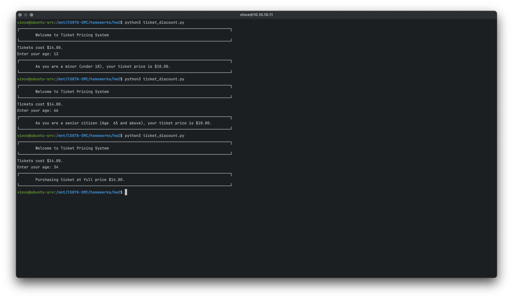
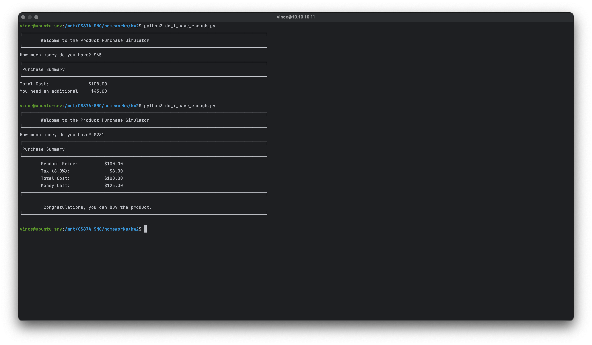
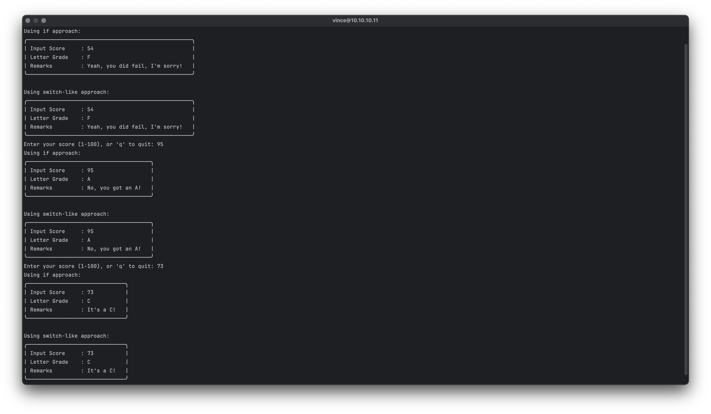
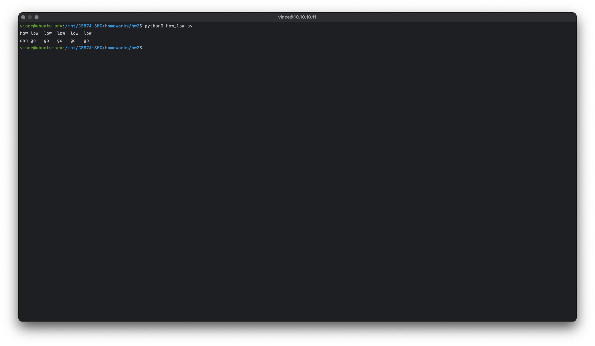
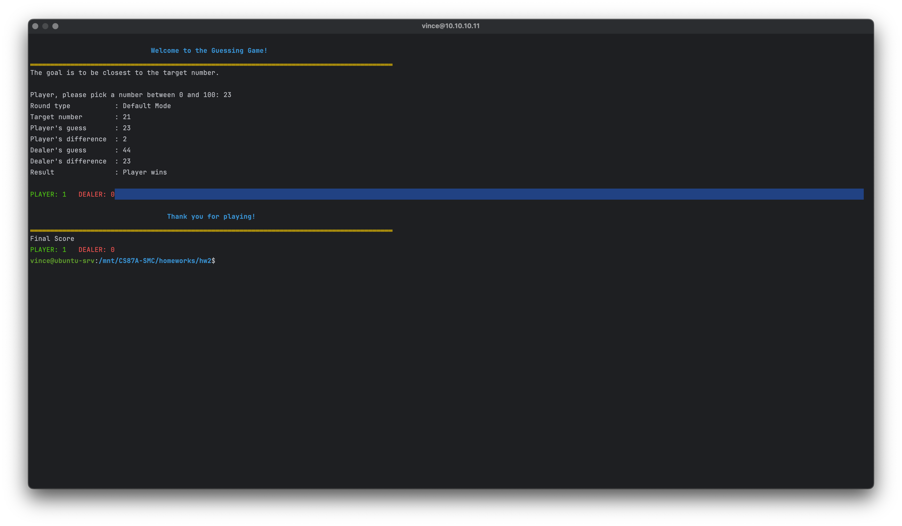
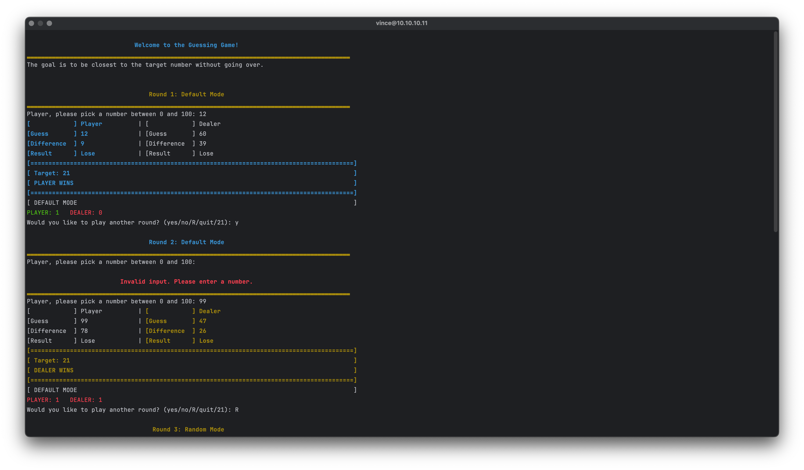
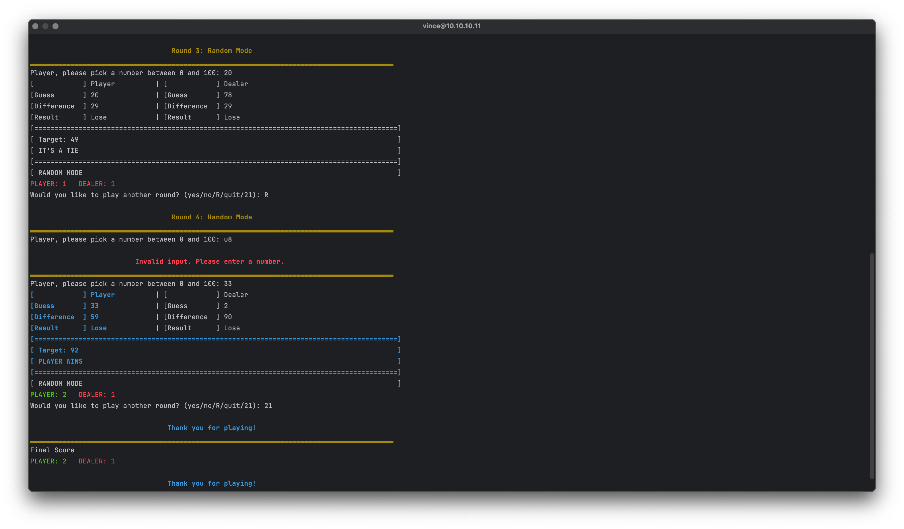

## Table of Contents

1. [ticket_discount.py](#ticket_discount.py)
2. [do_i_have_enough.py](#do_i_have_enough.py)
3. [did_i_fail.py](#did_i_fail.py)
4. [how_low.py](#how_low.py)
5. [guessing_game.py](#guessing_game.py)
6. [guessing_game_loop.py](#guessing_game_loop.py)

### ticket_discount.py

```python
"""
Vincent de Torres
CS87A-Summer 2024 
Filename: ticket_discount.py

This module simulates a ticket pricing system based on user age.
Users are prompted to enter their age, and based on the age:
- Minors (under 18) get a discounted ticket.
- Senior citizens (65 and older) get a discounted ticket.
- Others pay the full ticket price.

Constants:
- TICKET_COST (int): The standard ticket cost.
- MINOR_DISCOUNT (int): Discounted price for minors.
- SENIOR_DISCOUNT (int): Discounted price for seniors.
- MINOR_AGE_THRESHOLD (int): Age threshold for minors.
- SENIOR_AGE_THRESHOLD (int): Age threshold for seniors.

Functions:
- print_message(message): Prints a message in a banner-like ASCII art style.
- get_user_age(): Prompts the user to enter their age and returns it.
- calculate_ticket_price(age): Calculates the ticket price based on age.
- format_money(amount): Formats an amount as a monetary value with two decimal places.
- display_ticket_info(age, ticket_price): Displays ticket price information based on age.
- main(): Executes the main logic of the ticket pricing system.

"""

import datetime

# Constants for ticket pricing
TICKET_COST = 14
MINOR_DISCOUNT = 10
SENIOR_DISCOUNT = 10

MINOR_AGE_THRESHOLD = 18
SENIOR_AGE_THRESHOLD = 65

def print_message(message):
    """
    Prints a message in a banner-like ASCII art style using box-drawing characters.

    Parameters:
    - message (str): The message to be displayed.
    """
    border_top = '┌' + '─' * (90 + 2) + '┐'
    border_bottom = '└' + '─' * (90 + 2) + '┘'
    print(border_top)
    print(f'\t{message} ')
    print(border_bottom)

def get_user_age():
    """
    Prompt the user to enter their age and return it as an integer.
    """
    while True:
        try:
            age = int(input("Enter your age: "))
            return age
        except ValueError:
            print("Please enter a valid age (a number).")

def calculate_ticket_price(age):
    """
    Calculate the ticket price based on the user's age.
    Returns the calculated ticket price as an integer.
    """
    if age < MINOR_AGE_THRESHOLD:
        return MINOR_DISCOUNT
    elif age >= SENIOR_AGE_THRESHOLD:
        return SENIOR_DISCOUNT
    else:
        return TICKET_COST

def format_money(amount):
    """
    Format the given amount as a monetary value with dollar sign and two decimal places.
    """
    return f"${amount:.2f}"

def display_ticket_info(age, ticket_price):
    """
    Display information about the ticket price based on the user's age.
    """
    if age < MINOR_AGE_THRESHOLD:
        print_message(f"As you are a minor (under {MINOR_AGE_THRESHOLD}), your ticket price is {format_money(ticket_price)}.")
    elif age >= SENIOR_AGE_THRESHOLD:
        print_message(f"As you are a senior citizen (Age  {SENIOR_AGE_THRESHOLD} and above), your ticket price is {format_money(ticket_price)}.")
    else:
        print_message(f"Purchasing ticket at full price {format_money(ticket_price)}.")

def main():
    """
    Main function to simulate the ticket pricing scenario.
    """
    print_message("Welcome to Ticket Pricing System")
    print(f"Tickets cost {format_money(TICKET_COST)}.")
    age = get_user_age()
    ticket_price = calculate_ticket_price(age)
    display_ticket_info(age, ticket_price)
 
# Execute the main function
if __name__ == "__main__":
    main()
```



### do_i_have_enough.py

```python
"""
Vincent de Torres
CS87A-Summer 2024 
Filename: do_i_have_enough.py

This module simulates a scenario where a user wants to determine if they can afford a product. 
It calculates the total cost of the product including an 8% sales tax, prompts the user to input 
the amount of money they have, and checks if they can afford the purchase. It then displays a 
purchase summary including the breakdown of cost, tax, total amount, and whether the purchase is 
affordable based on the user's input.

Constants:
- TAX_RATE (float): The tax rate applied to the product price (8%).
- PRODUCT_PRICE (float): The base price of the product before tax.

Functions:
- print_message(message): Prints a message in a banner-like ASCII art style using box-drawing characters.
- calculate_total_cost(price): Calculates the total cost of the product including tax.
- prompt_for_money(): Prompts the user to input how much money they have.
- check_affordability(money, total_cost): Checks if the user can afford the product based on their money and total cost.
- display_purchase_result(affordable, total_cost, money): Displays the purchase summary including cost breakdown.
- do_i_have_enough(): Main function to simulate the process of determining if the user can afford a product.
- main(): Executes the main function to initiate the simulation.

"""
TAX_RATE = 0.08
PRODUCT_PRICE = 100.0

def print_message(message):
    """
    Prints a message in a banner-like ASCII art style using box-drawing characters.

    Parameters:
    - message (str): The message to be displayed.
    """
    border_top = '┌' + '─' * (90 + 2) + '┐'
    border_bottom = '└' + '─' * (90 + 2) + '┘'
    print(border_top)
    print(f' {message} ')
    print(border_bottom)

def calculate_total_cost(price):
    """
    Calculate the total cost including tax.

    Parameters:
    - price (float): The price of the product.

    Returns:
    - float: The total cost including tax.
    """
    total_cost = price * (1 + TAX_RATE)
    return total_cost

def prompt_for_money():
    """
    Prompt the user to input how much money they have.

    Returns:
    - float: Amount of money user inputs.
    """
    while True:
        try:
            money = float(input("How much money do you have? $"))
            return money
        except ValueError:
            print("Please enter a valid amount (numbers only).")

def check_affordability(money, total_cost):
    """
    Check if the user can afford the product based on their money and total cost.

    Parameters:
    - money (float): Amount of money user has.
    - total_cost (float): Total cost of the product including tax.

    Returns:
    - bool: True if user can afford, False otherwise.
    """
    return money >= total_cost

def display_purchase_result(affordable, total_cost, money):
    """
    Display the result of whether the user can afford the product and breakdown of cost, tax, and total.

    Parameters:
    - affordable (bool): Whether the user can afford the product.
    - total_cost (float): Total cost of the product including tax.
    - money (float): Amount of money user has.
    """
    print_message("Purchase Summary")
    if affordable:
        tax_amount = total_cost - PRODUCT_PRICE
        print(f"\t{('Product Price:'):<20} {f'${PRODUCT_PRICE:.2f}':>10}")
        print(f"\t{('Tax (' + f'{TAX_RATE * 100}' + '%):'): <20} {f'${tax_amount:.2f}':>10}")
        print(f"\t{('Total Cost:'):<20} {f'${total_cost:.2f}':>10}")
        print(f"\t{('Money Left:'):<20} {f'${money - total_cost:.2f}':>10}")
        print_message(f"\n\t Congratulations, you can buy the product.")
    else:
        print(f"{('Total Cost:'):<20} {f'${total_cost:.2f}':>12}")
        if money < total_cost:
            print(f"{'You need an additional':<20} {f'${total_cost - money:.2f}':>10}")
        else:
            print(f"{'Sorry, you cannot afford the product.':^40}")
    print("")

 
def do_i_have_enough():
    """
    Function to determine if the user can afford a product.
    """
    total_cost = calculate_total_cost(PRODUCT_PRICE)
    
    money = prompt_for_money()
    affordable = check_affordability(money, total_cost)
    display_purchase_result(affordable, total_cost, money)

def main():
    """
    Main function to simulate the process of determining if the user can afford a product.
    """
    print_message("\tWelcome to the Product Purchase Simulator")
    do_i_have_enough()

# Execute the main function
if __name__ == "__main__":
    main()
```



### did_i_fail.py

```python
"""
Vincent de Torres
CS87A-Summer 2024 
Filename:did_i_fail.py

This script calculates and displays the grade and remarks based on a provided score.
It includes constants for grade thresholds and remarks, functions for input handling,
grade determination using both if and switch-like approaches, and display functions.

Constants:
- GRADE_THRESHOLDS: Dictionary defining grade thresholds and associated remarks.
- LABEL_INPUT_SCORE: Label for input score display.
- LABEL_LETTER_GRADE: Label for letter grade display.
- LABEL_REMARKS: Label for remarks display.
- WIDTH_SCORE: Width for input score alignment.

Functions:
- print_message(text, max_width=None): Formats text into a box with optional maximum width.
- preprocess_input(user_input): Sanitizes and converts user input to an integer.
- determine_grade_switch(score): Determines grade and remarks using a switch-like approach based on score.
- determine_grade(score): Determines grade and remarks using if-elif conditions based on score.
- display_grade(input_score, letter_grade, remarks): Displays formatted input score, letter grade, and remarks.
- get_score(): Prompts user to enter a score between 1 and 100.
"""

# Constants defining grade thresholds and remarks
GRADE_THRESHOLDS = {
    "A": (90, 100, "No, you got an A!"),
    "B": (80, 89, "No, you got a B!"),
    "C": (70, 79, "It's a C!"),
    "D": (60, 69, "It's a D!"),
    "F": (0, 59, "Yeah, you did fail, I'm sorry!"),
}

# Constants for display labels and widths
LABEL_INPUT_SCORE = "Input Score"
LABEL_LETTER_GRADE = "Letter Grade"
LABEL_REMARKS = "Remarks"
WIDTH_SCORE = 3  # Width for input score alignment


def print_message(text, max_width=None):
    """
    Formats text into a box with optional maximum width.

    Args:
    - text (str or list): Text to be formatted into a box. Can be a single string or a list of strings.
    - max_width (int, optional): Maximum width for the box. Defaults to None.

    Returns:
    - str: Formatted text enclosed in a box.

    Raises:
    - ValueError: If input is not a string or a list of strings.
    """
    if isinstance(text, str):
        lines = [text]
    elif isinstance(text, list):
        lines = text
    else:
        raise ValueError("Input must be a string or a list of strings.")

    if max_width:
        lines = [line[:max_width] for line in lines]

    min_width = max(len(line) for line in lines)  # Determine minimum width based on longest line
    box_width = min_width + 4  # Border and padding width based on minimum width

    result = []
    result.append(f"╭{'─' * box_width}╮")
    for line in lines:
        padding = ' ' * (min_width - len(line) + 2)
        result.append(f"| {line}{padding} |")
    result.append(f"╰{'─' * box_width}╯")

    return '\n'.join(result)


def preprocess_input(user_input):
    """Sanitize and convert user input to an integer."""
    try:
        processed_input = int(user_input.strip())  # Remove any leading/trailing whitespace and convert to int
        return processed_input
    except ValueError:
        return None  # Return None if input cannot be converted to an integer


def determine_grade_switch(score):
    """Determine grade and remarks based on the provided score using a floor division approach."""
    switch_value = score // 10
    
    # Using match-case (available from Python 3.10+)
    match switch_value:
        case 10:
            return "A", "No, you got an A!"
        case 9:
            return "A", "No, you got an A!"
        case 8:
            return "B", "No, you got a B!"
        case 7:
            return "C", "It's a C!"
        case 6:
            return "D", "It's a D!"
        case _:
            return "F", "Yeah, you did fail, I'm sorry!"


def determine_grade(score):
    """Determine grade and remarks based on the provided score."""
    for grade, (lower, upper, remarks) in GRADE_THRESHOLDS.items():
        if lower <= score <= upper:
            return grade, remarks
    return None, "Invalid score entered."


def display_grade(input_score, letter_grade, remarks):
    """Display the input score, letter grade, and remarks with aligned key-value pairs."""
    output = []
    output.append(f"{LABEL_INPUT_SCORE:<15} : {input_score}")  # Left-aligned label, right-aligned score
    output.append(f"{LABEL_LETTER_GRADE:<15} : {letter_grade}")  # Left-aligned label, left-aligned grade
    output.append(f"{LABEL_REMARKS:<15} : {remarks}")  # Left-aligned label, left-aligned remarks

    print(print_message(output))


def get_score():
    """Prompt user to enter a score between 1 and 100."""
    while True:
        score_input = input("Enter your score (1-100), or 'q' to quit: ").strip().lower()
        if score_input == 'q':
            return 'q'  # Signal to quit
        score = preprocess_input(score_input)
        if score is not None and 1 <= score <= 100:
            return score
        else:
            print("Invalid input. Please enter a number between 1 and 100.")


def main():
    """Main function to run the grade calculator."""
    while True:
        score = get_score()
        if score == 'q':
            break  # Exit loop if user enters 'q'
        
        score = int(score)  # Convert score to integer after confirming it's not 'q'
        
        # Using the if approach
        grade, remarks = determine_grade(score)
        if grade:
            print("Using if approach:")
            display_grade(score, grade, remarks)
        else:
            print(remarks)
        
        # Using the switch-like approach
        grade_switch, remarks_switch = determine_grade_switch(score)
        if grade_switch:
            print("\nUsing switch-like approach:")
            display_grade(score, grade_switch, remarks_switch)
        else:
            print(remarks_switch)


if __name__ == "__main__":
    main()
```



### how_low.py

```python
"""
Vincent de Torres
CS87A-Summer 2024 
Filename: ticket_discount.py

Prints two lines of text:
1. 'how low low low ...' with a specified number of iterations using a for loop.
2. 'can you go go go ...' with a specified number of iterations using a while loop.

Constants:
- NUM_ITERATIONS (int): Number of iterations for both lines.

Functions:
- print_low_line(num_iterations): Prints the first line with 'how low' repeated.
- print_go_line(num_iterations): Prints the second line with 'can you go' repeated.
- main(): Executes the program by calling print functions.

Usage:
Run the script to see the output lines printed with the specified number of iterations.
"""

NUM_ITERATIONS = 5  # Number of iterations for both lines

def print_low_line(num_iterations):
    """
    Prints 'how low low low ...' with specified number of iterations.

    Args:
    - num_iterations (int): Number of times to print 'low'.

    """
    print("how", end=" ")
    for _ in range(num_iterations):
        print(f"{'low':<4}", end=" ")
    print()

def print_go_line(num_iterations):
    """
    Prints 'can you go go go ...' with specified number of iterations using a while loop.

    Args:
    - num_iterations (int): Number of times to print 'go'.

    """
    print("can", end=" ")
    count = 0
    while count < num_iterations:
        print(f"{'go':<4}", end=" ")
        count += 1
    print()

def main():
    """
    Main function to execute the program.
    """
    print_low_line(NUM_ITERATIONS)
    print_go_line(NUM_ITERATIONS)

if __name__ == "__main__":
    main()
```



### guessing_game.py

```python

"""
Vincent de Torres
CS87A-Summer 2024
Filename: guessing_game.py

This module simulates a guessing game where the player and the dealer (program) each guess a number. The goal is to be closest to the target number without going over. The player and dealer are randomly assigned colors (blue or yellow) for each game, and the banner theme color is based on who is leading.

Constants:
- DEFAULT_TARGET (int): The default target number to be guessed.
- LOWER_BOUND (int): The lower bound for guesses.
- UPPER_BOUND (int): The upper bound for guesses.

Functions:
- clear_screen(): Clears the terminal screen.
- print_message(message, color=ANSI_RESET): Prints a message with a border and optional color.
- welcome_message(): Displays the welcome message for the game.
- get_player_guess(): Prompts the player to enter a guess within the specified bounds.
- generate_dealer_guess(): Generates a random guess for the dealer.
- calculate_difference(target, guess): Calculates the difference between the target and a guess.
- determine_winner(player_guess, dealer_guess, target): Determines the winner based on the closest guess to the target.
- print_game_details(target, player_guess, player_difference, dealer_guess, dealer_difference, result, round_type, color): Prints the details of the game round.
- generate_target_number(): Generates a random target number between the lower and upper bounds.
- play_again(): Prompts the player to decide whether to play another round.
- print_lead(player_points, dealer_points, player_color, dealer_color): Prints the current lead based on points and returns the leading color.
- input_processor(): Processes the game logic, manages rounds, and tracks scores.
- main(): Executes the main game flow.
"""

import random
import os

DEFAULT_TARGET = 21
LOWER_BOUND = 0
UPPER_BOUND = 100

ANSI_RED = "\033[31m"
ANSI_GREEN = "\033[32m"
ANSI_BRIGHT_GREEN = "\033[92m"
ANSI_BLUE = "\033[34m"
ANSI_YELLOW = "\033[33m"
ANSI_RESET = "\033[0m"
ANSI_BOLD = "\033[1m"


def clear_screen():
    os.system('clear')

def print_message(message, color=ANSI_RESET):
    def print_border(width=90,color=ANSI_RESET):
        print(f"{color}{'▂' * width}{ANSI_RESET}")
    def print_message(message, width=90, align='center'):
        if align == 'center':
            print(f"{color}{ANSI_BOLD}{message.center(width)}{ANSI_RESET}")
        elif align == 'left':
            print(f"{color}{message.ljust(width)}{ANSI_RESET}")
        elif align == 'right':
            print(f"{color}{message.rjust(width)}{ANSI_RESET}")
    def print_empty_line():
        print()
    
    print_empty_line()
    print_message(message, align='center')
    print_border(color=ANSI_YELLOW)

def welcome_message():
    clear_screen()
    print_message("Welcome to the Guessing Game!", ANSI_BLUE)
    print("The goal is to be closest to the target number.")
    print()

def get_player_guess():
    while True:
        try:
            guess = int(input("Player, please pick a number between 0 and 100: "))
            if LOWER_BOUND <= guess <= UPPER_BOUND:
                return guess
            else:
                print_message("Please enter a number between 0 and 100.", ANSI_RED)
        except ValueError:
            print_message("Invalid input. Please enter a number.", ANSI_RED)

def generate_dealer_guess():
    return random.randint(LOWER_BOUND, UPPER_BOUND)

def calculate_difference(target, guess):
    return abs(target - guess)

def determine_winner(player_guess, dealer_guess, target):
    player_difference = calculate_difference(target, player_guess)
    dealer_difference = calculate_difference(target, dealer_guess)
    
    if player_difference < dealer_difference:
        result = "Player wins"
    elif dealer_difference < player_difference:
        result = "Dealer wins"
    else:
        result = "It's a tie"
    
    return result, player_difference, dealer_difference

def print_game_details(target, player_guess, player_difference, dealer_guess, dealer_difference, result, round_type, color):
    print(f"{'Round type':<20} : {round_type}")
    print(f"{'Target number':<20} : {target}")
    print(f"{'Player\'s guess':<20} : {player_guess}")
    print(f"{'Player\'s difference':<20} : {player_difference}")
    print(f"{'Dealer\'s guess':<20} : {dealer_guess}")
    print(f"{'Dealer\'s difference':<20} : {dealer_difference}")
    print(f"{'Result':<20} : {result}")
    print()

def generate_target_number():
    """Generate a random target number between 0 and 100."""
    return random.randint(LOWER_BOUND, UPPER_BOUND)

 

def print_lead(player_points, dealer_points, player_color, dealer_color):
    lead_color = player_color if player_points > dealer_points else dealer_color
    player_score_color = ANSI_BRIGHT_GREEN if player_points > dealer_points else ANSI_RED
    dealer_score_color = ANSI_BRIGHT_GREEN if dealer_points > player_points else ANSI_RED
    
    print(f"{player_score_color}PLAYER: {player_points}{ANSI_RESET}   {dealer_score_color}DEALER: {dealer_points}{ANSI_RESET}")
    return lead_color

def input_processor():
    target = DEFAULT_TARGET
    player_color = random.choice([ANSI_BLUE, ANSI_YELLOW])
    dealer_color = ANSI_YELLOW if player_color == ANSI_BLUE else ANSI_BLUE
    
    round_type = "Default Mode"
    welcome_message()
    
    player_guess = get_player_guess()
    dealer_guess = generate_dealer_guess()
    
    result, player_difference, dealer_difference = determine_winner(player_guess, dealer_guess, target)
    
    if result == "Player wins":
        player_points = 1
        dealer_points = 0
    elif result == "Dealer wins":
        player_points = 0
        dealer_points = 1
    else:
        player_points = 0
        dealer_points = 0
    
    print_game_details(target, player_guess, player_difference, dealer_guess, dealer_difference, result, round_type, player_color)
    
    lead_color = print_lead(player_points, dealer_points, player_color, dealer_color)
    
    

    print_message("Thank you for playing!", lead_color)
    print(f"{'Final Score':<20}")
    print_lead(player_points, dealer_points, player_color, dealer_color)

def main():
    input_processor()

if __name__ == "__main__":
    main()
```



### guessing_game_loop.py

```python
"""
Vincent de Torres
CS87A-Summer 2024
Filename: guessing_game.py

This module simulates a guessing game where the player and the dealer (program) each guess a number. 
The goal is to be closest to the target number .


Constants:
- DEFAULT_TARGET (int): The default target number to be guessed.
- LOWER_BOUND (int): The lower bound for guesses.
- UPPER_BOUND (int): The upper bound for guesses.

Functions:
- clear_screen(): Clears the terminal screen.
- print_message(message, color=ANSI_RESET): Prints a message with a border and optional color.
- welcome_message(): Displays the welcome message for the game.
- get_player_guess(): Prompts the player to enter a guess within the specified bounds.
- generate_dealer_guess(): Generates a random guess for the dealer.
- calculate_difference(target, guess): Calculates the difference between the target and a guess.
- determine_winner(player_guess, dealer_guess, target): Determines the winner based on the closest guess to the target.
- print_game_details(target, player_guess, player_difference, dealer_guess, dealer_difference, result, round_type, color): Prints the details of the game round.
- generate_target_number(): Generates a random target number between the lower and upper bounds.
- play_again(): Prompts the player to decide whether to play another round.
- print_lead(player_points, dealer_points, player_color, dealer_color): Prints the current lead based on points and returns the leading color.
- input_processor(): Processes the game logic, manages rounds, and tracks scores.
- main(): Executes the main game flow.
"""

import random
import os

DEFAULT_TARGET = 21
LOWER_BOUND = 0
UPPER_BOUND = 100

#Tie/Null, Player, Dealer, Invalid


ANSI_RED = "\033[91m"
ANSI_GREEN = "\033[32m"
ANSI_BRIGHT_GREEN = "\033[92m"
ANSI_BLUE = "\033[34m"
ANSI_YELLOW = "\033[33m"
ANSI_RESET = "\033[0m"
ANSI_BOLD = "\033[1m"

GAME_STATUS= {
    "Tie": ANSI_BRIGHT_GREEN,
    "Player": ANSI_BLUE,
    "Dealer": ANSI_YELLOW,
    "Invalid": ANSI_RED,
    "Neutral": ANSI_RESET
}

ROUND_STATUS = "Neutral"

def clear_screen():
    os.system('clear')

def print_message(message, color=ANSI_RESET):
    def print_border(width=90,color=ANSI_RESET):
        print(f"{color}{'▂' * width}{ANSI_RESET}")
    def print_message(message, width=90, align='center'):
        if align == 'center':
            print(f"{color}{ANSI_BOLD}{message.center(width)}{ANSI_RESET}")
        elif align == 'left':
            print(f"{color}{message.ljust(width)}{ANSI_RESET}")
        elif align == 'right':
            print(f"{color}{message.rjust(width)}{ANSI_RESET}")
    def print_empty_line():
        print()
    
    print_empty_line()
    print_message(message, align='center')
    print_border(color=ANSI_YELLOW)

def welcome_message():
    clear_screen()
    print_message("Welcome to the Guessing Game!", ANSI_BLUE)
    print("The goal is to be closest to the target number without going over.")
    print()

def get_player_guess():
    while True:
        try:
            guess = int(input("Player, please pick a number between 0 and 100: "))
            if LOWER_BOUND <= guess <= UPPER_BOUND:
                return guess
            else:
                print_message("Please enter a number between 0 and 100.", ANSI_RED)
        except ValueError:
            print_message("Invalid input. Please enter a number.", ANSI_RED)

def generate_dealer_guess():
    return random.randint(LOWER_BOUND, UPPER_BOUND)

def calculate_difference(target, guess):
    return abs(target - guess)

def determine_winner(player_guess, dealer_guess, target):
    global ROUND_STATUS

    player_difference = calculate_difference(target, player_guess)
    dealer_difference = calculate_difference(target, dealer_guess)
    
    if player_difference < dealer_difference:
        result = "Player wins"
        ROUND_STATUS = "Player"
    elif dealer_difference < player_difference:
        result = "Dealer wins"
        ROUND_STATUS = "Dealer"
    else:
        result = "It's a tie"
        ROUND_STATUS = "Tie"
    
    return result, player_difference, dealer_difference

def print_game_details(target, player_guess, player_difference, dealer_guess, dealer_difference, result, round_type, round_status):
    headers = [" ","Guess", "Difference", "Result"]
    player_values = ["Player", player_guess, player_difference, "Win" if round_status.lower() == 'player' else "Lose"]
    dealer_values = ["Dealer", dealer_guess, dealer_difference, "Win" if round_status.lower() == 'dealer' else "Lose"]

    # Determine color based on round_status
    if ROUND_STATUS.lower() == 'player':
        player_color = f"{ANSI_BOLD}{ANSI_BLUE}"
        dealer_color = ANSI_RESET
        win_color = f"{ANSI_BOLD}{ANSI_BLUE}"
    elif ROUND_STATUS.lower() == 'dealer':
        player_color = ANSI_RESET
        dealer_color = f"{ANSI_BOLD}{ANSI_YELLOW}"
        win_color = f"{ANSI_BOLD}{ANSI_YELLOW}"
    else:
        player_color = ANSI_RESET
        dealer_color = ANSI_RESET
        win_color = ANSI_RESET


    # Print player and dealer rows side by side
    for header, player_value, dealer_value in zip(headers, player_values, dealer_values):
        print(f"{player_color}[{header:<12}] {player_value:<15}{ANSI_RESET} | {dealer_color}[{header:<12}] {dealer_value:<15}{ANSI_RESET}")

    print(f"{win_color}[{'=' * 90}]")
    print(f"[ {'Target:':<7} {target:<80} ]")

    print(f"[ {result.upper():<88} ]")
    print(f"[{'=' * 90}]{ANSI_RESET}")
    # Print headers with formatting
    print(f"[ {round_type.upper():<88} ]")
    
    
def print_row(headers, values, color):
    # Print each row with proper alignment
    for header, value in zip(headers, values):
        print(f"{color}[{header:<10}] {value:^10}{ANSI_RESET}")


def generate_target_number():
    """Generate a random target number between 0 and 100."""
    return random.randint(LOWER_BOUND, UPPER_BOUND)

def play_again():
    while True:
        play_again = input("Would you like to play another round? (yes/no/R/quit/21): ").strip().lower()
        if play_again in ('yes', 'y', 'no', 'n', 'r', '21'):
            return play_again
        else:
            print(f"{ANSI_RED}{ANSI_BOLD} \tInvalid input. Please enter yes, no, R, quit, or 21.{ANSI_RESET}")


def print_lead(player_points, dealer_points, player_color, dealer_color):
    lead_color = player_color if player_points > dealer_points else dealer_color
    player_score_color = ANSI_BRIGHT_GREEN if player_points > dealer_points else ANSI_RED
    dealer_score_color = ANSI_BRIGHT_GREEN if dealer_points > player_points else ANSI_RED
    
    print(f"{player_score_color}PLAYER: {player_points}{ANSI_RESET}   {dealer_score_color}DEALER: {dealer_points}{ANSI_RESET}")
    return lead_color

def input_processor():
    target = DEFAULT_TARGET
    player_points = 0
    dealer_points = 0
    round_number = 1

    player_color = random.choice([ANSI_BLUE, ANSI_YELLOW])
    dealer_color = ANSI_YELLOW if player_color == ANSI_BLUE else ANSI_BLUE
    
    while True:
        round_type = "Default Mode" if target == DEFAULT_TARGET else "Random Mode"
        
        lead_color = player_color if player_points > dealer_points else dealer_color
        print_message(f"Round {round_number}: {round_type}", lead_color)
        
        player_guess = get_player_guess()
        dealer_guess = generate_dealer_guess()
        
        result, player_difference, dealer_difference = determine_winner(player_guess, dealer_guess, target)
        
        if result == "Player wins":
            player_points += 1
        elif result == "Dealer wins":
            dealer_points += 1
        
        print_game_details(target, player_guess, player_difference, dealer_guess, dealer_difference, result, round_type, lead_color)
        
        lead_color = print_lead(player_points, dealer_points, player_color, dealer_color)
        
        play_again_choice = play_again()
        
        if play_again_choice == 'r':
            target = generate_target_number()
        elif play_again_choice in ('yes', 'y'):
            target = DEFAULT_TARGET
        else:
            break
        
        round_number += 1
     
    print_message("Thank you for playing!", lead_color)
    print(f"{'Final Score':<20}")
    print_lead(player_points, dealer_points, player_color, dealer_color)

def main():
    welcome_message()
    input_processor()
    print_message("Thank you for playing!", ANSI_BLUE)

if __name__ == "__main__":
    main()```




