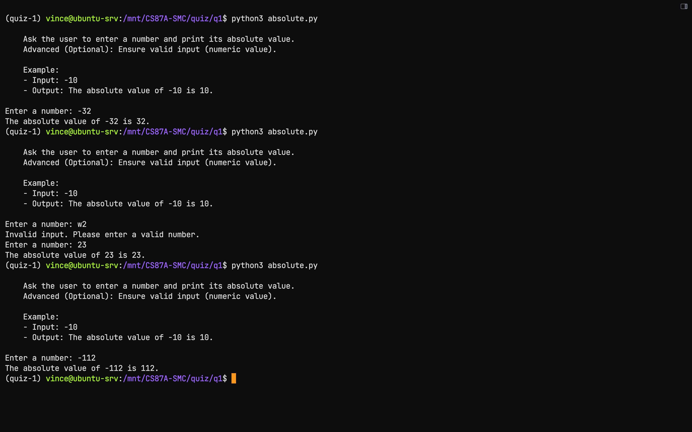
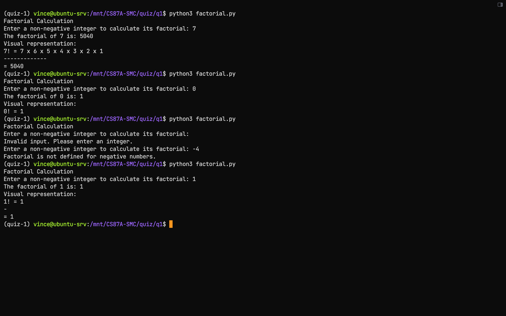
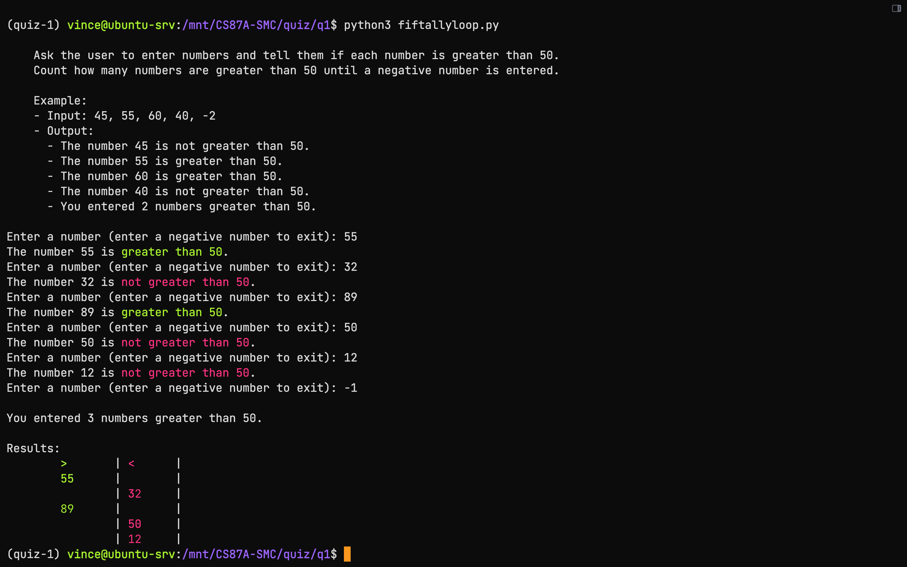
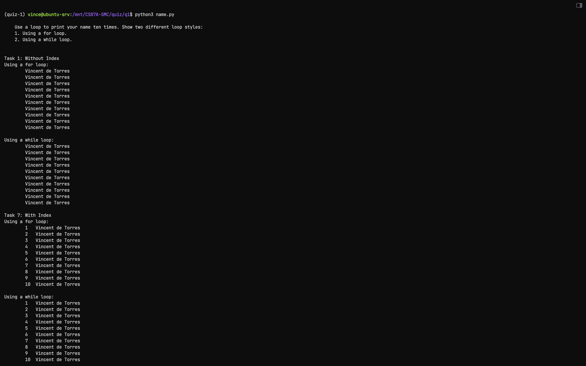
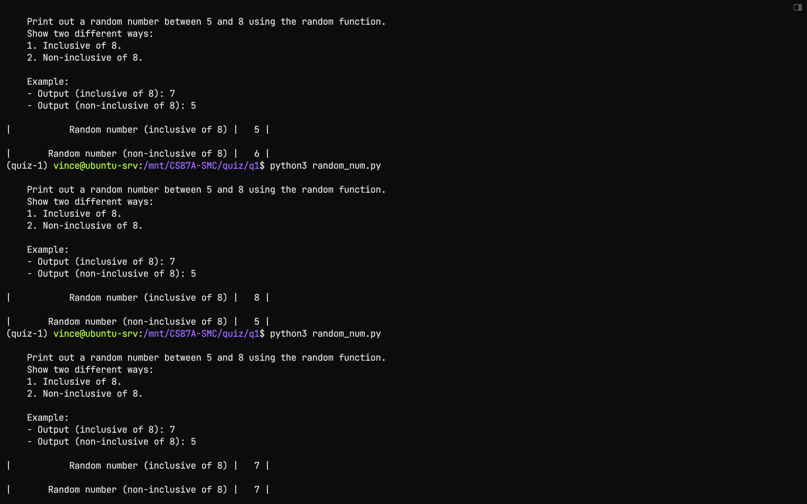
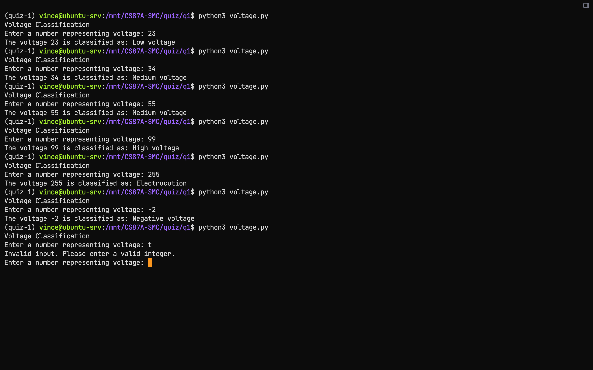

## Table of Contents

1. [absolute.py](#absolute.py)
2. [factorial.py](#factorial.py)
3. [fiftallyloop.py](#fiftallyloop.py)
4. [name.py](#name.py)
5. [quiz1.py](#quiz1.py)
6. [random_num.py](#random_num.py)
7. [voltage.py](#voltage.py)

### absolute.py

```python
"""
Vincent de Torres
CS87A-Summer 2024 
Filename: absolute.py

Problem #3: Absolute

Ask the user to enter a number and print its absolute value.
Advanced (Optional): Ensure valid input (numeric value).

Example:
- Input: -10
- Output: The absolute value of -10 is 10.
"""

def print_task():
    print("""
    Ask the user to enter a number and print its absolute value.
    Advanced (Optional): Ensure valid input (numeric value).
    
    Example:
    - Input: -10
    - Output: The absolute value of -10 is 10.
    """)

def validate_input(input_str):
    """
    Validates if the input string represents a numeric value.
    
    Parameters:
    - input_str (str): The input string to validate.
    
    Returns:
    - bool: True if the input string is numeric, False otherwise.
    """
    return input_str.lstrip('-').isdigit()

def main():
    print_task()
    while True:
        num_str = input("Enter a number: ")
        if validate_input(num_str):
            num = int(num_str)
            print(f"The absolute value of {num} is {abs(num)}.")
            break
        else:
            print("Invalid input. Please enter a valid number.")

if __name__ == "__main__":
    main()

```



### factorial.py

```python
"""
Vincent de Torres
CS87A-Summer 2024 
Filename: factorial_visualization.py

Problem:
Calculate the factorial of a non-negative integer provided by the user and visualize it as a product sequence.

Example:
- Input: 5
- Output: The factorial of 5 is: 120
         Visual representation:
         5! = 5 x 4 x 3 x 2 x 1
         ----------------------
         = 120

Special Cases:
- 0! = 1 (By definition)
- Factorial is not defined for negative numbers.

References:
- Python math module documentation: https://docs.python.org/3/library/math.html
"""

import math

def get_valid_integer(prompt):
    """
    Prompts the user for an integer input and validates it.
    
    Returns:
    - An integer inputted by the user.
    
    Raises:
    - ValueError: If the input is not a valid integer.
    """
    while True:
        try:
            value = int(input(prompt))
            return value
        except ValueError:
            print("Invalid input. Please enter an integer.")

def get_factorial(num):
    """
    Computes the factorial of a non-negative integer using math.factorial.
    
    Args:
    - num (int): Non-negative integer for which factorial is to be computed.
    
    Returns:
    - Factorial of num.
    
    Raises:
    - ValueError: If num is negative.
    """
    if num < 0:
        raise ValueError("Factorial is not defined for negative numbers.")
    return math.factorial(num)

def print_factorial_visualization(num):
    """
    Prints a visual representation of factorial as a product sequence from num! down to 1.
    
    Args:
    - num (int): Non-negative integer for which to calculate and print factorial product sequence.
    """
    print("Visual representation:")
    if num == 0:
        print("0! = 1")  # Special case for 0! which is 1
    else:
        print(f"{num}! = ", end="")
        expression = " x ".join(str(i) for i in range(num, 0, -1))
        print(expression)
        print("-" * len(expression.replace(" ", "")))
        factorial_value = math.factorial(num)
        print(f"= {factorial_value}")

def main():
    """
    Main function to calculate and display factorial of a user-provided integer.
    """
    print("Factorial Calculation")
    
    # Get input value
    num = get_valid_integer("Enter a non-negative integer to calculate its factorial: ")
    
    # Calculate factorial
    try:
        result = get_factorial(num)
        print(f"The factorial of {num} is: {result}")
        
        # Print factorial visual representation
        print_factorial_visualization(num)
        
    except ValueError as e:
        print(e)

if __name__ == "__main__":
    main()

```



### fiftallyloop.py

```python
"""
Vincent de Torres
CS87A-Summer 2024 
Filename: fifty.py

Problem #2 and #8: Fifty and Count Greater than 50

Ask the user to enter numbers and tell them if each number is greater than 50. 
Count how many numbers are greater than 50 until a negative number is entered.

Example:
- Input: 45, 55, 60, 40, -2
- Output:
  - The number 45 is not greater than 50.
  - The number 55 is greater than 50.
  - The number 60 is greater than 50.
  - The number 40 is not greater than 50.
  - You entered 2 numbers greater than 50.
"""

# ANSI color codes
RED = '\033[91m'
GREEN = '\033[92m'
YELLOW = '\033[93m'
RESET = '\033[0m'

def print_task():
    print("""
    Ask the user to enter numbers and tell them if each number is greater than 50. 
    Count how many numbers are greater than 50 until a negative number is entered.
    
    Example:
    - Input: 45, 55, 60, 40, -2
    - Output:
      - The number 45 is not greater than 50.
      - The number 55 is greater than 50.
      - The number 60 is greater than 50.
      - The number 40 is not greater than 50.
      - You entered 2 numbers greater than 50.
    """)

def validate_input(input_str):
    """
    Validates if the input string represents a numeric value.
    
    Parameters:
    - input_str (str): The input string to validate.
    
    Returns:
    - bool: True if the input string is numeric, False otherwise.
    """
    return input_str.lstrip('-').isdigit()

def check_number(num):
    """
    Checks if the provided number is greater than 50.
    
    Parameters:
    - num (int): The number to check.
    
    Returns:
    - bool: True if the number is greater than 50, False otherwise.
    """
    if num > 50:
        return True
    else:
        return False

def main():
    print_task()
    results = [(">","<")]
    while True:
        num_str = input("Enter a number (enter a negative number to exit): ")
        if validate_input(num_str):
            num = int(num_str)
            if num < 0:
                break
            if check_number(num):
                print(f"The number {num} is {GREEN}greater than 50{RESET}.")
                results.append((num, ''))
            else:
                print(f"The number {num} is {RED}not greater than 50{RESET}.")
                results.append(('', num))
        else:
            print("Invalid input. Please enter a valid number.")
    
    count_greater_than_50 = sum(1 for result in results if result[0] != '')
    print(f"\nYou entered {count_greater_than_50} numbers greater than 50.\n")
    
    # Print results in a table-like format
    print("Results:")
    for num1, num2 in results:
        num1_str = f"{GREEN}{num1:<3}{RESET}" if num1 != '' else ''
        num2_str = f"{RED}{num2:<3}{RESET}" if num2 != '' else ''
        print(f"\t{num1_str:<3} \t| {num2_str:<3}\t |")

if __name__ == "__main__":
    main()

```



### name.py

```python
"""
Vincent de Torres
CS87A-Summer 2024 
Filename: print_name.py

Problem #1: Print Name

Use a loop to print your name ten times. Show two different loop styles:
1. Using a for loop.
2. Using a while loop.
"""

NAME = "Vincent de Torres"

def print_task():
    print("""
    Use a loop to print your name ten times. Show two different loop styles:
    1. Using a for loop.
    2. Using a while loop.
    """)

def print_with_for_loop(indexed=True):
    """
    Prints the name using a for loop ten times, with an optional index before the name.
    
    Args:
    - indexed (bool): If True, prints the index before the name. Default is True.
    """
    print("Using a for loop:")
    for i in range(10):
        if indexed:
            print(f"\t{(i+1):<3} {NAME:<20}")
        else:
            print(f"\t{NAME:<20}")

def print_with_while_loop(indexed=True):
    """
    Prints the name using a while loop ten times, with an optional index before the name.
    
    Args:
    - indexed (bool): If True, prints the index before the name. Default is True.
    """
    print("\nUsing a while loop:")
    counter = 0
    while counter < 10:
        if indexed:
            print(f"\t{(counter+1):<3} {NAME:<20}")
        else:
            print(f"\t{NAME:<20}")
        counter += 1

def main():
    print_task()
    
    # Print Task 1 versions without index
    print("\nTask 1: Without Index")
    print_with_for_loop(indexed=False)
    print_with_while_loop(indexed=False)
    
    # Print Task 7 versions with index=True
    print("\nTask 7: With Index")
    print_with_for_loop(indexed=True)
    print_with_while_loop(indexed=True)

if __name__ == "__main__":
    main()

```



   
### random_num.py

```python
"""
Vincent de Torres
CS87A-Summer 2024 
Filename: random.py

Problem #4: Random

Print out a random number between 5 and 8 using the random function.
Show two different ways:
1. Inclusive of 8.
2. Non-inclusive of 8.

Example:
- Output (inclusive of 8): 7
- Output (non-inclusive of 8): 5
"""

import random

def print_task():
    print("""
    Print out a random number between 5 and 8 using the random function.
    Show two different ways:
    1. Inclusive of 8.
    2. Non-inclusive of 8.
    
    Example:
    - Output (inclusive of 8): 7
    - Output (non-inclusive of 8): 5
    """)

def generate_random_inclusive():
    """
    Generates a random number inclusive of 8 between 5 and 8.
    """
    random_num_inclusive = random.randint(5, 8)
    print(f"| {'Random number (inclusive of 8)':>40} | {random_num_inclusive:>3} |")

def generate_random_non_inclusive():
    """
    Generates a random number non-inclusive of 8 between 5 and 7.
    """
    random_num_non_inclusive = random.randint(5, 7)
    print(f"| {'Random number (non-inclusive of 8)':>40} | {random_num_non_inclusive:>3} |")

def main():
    print_task()
    generate_random_inclusive()
    print()
    generate_random_non_inclusive()

if __name__ == "__main__":
    main()

```



### voltage.py

```python
"""
Vincent de Torres
CS87A-Summer 2024 
Filename: voltage.py

Problem:
Ask a user to enter a number representing voltage and classify it into different categories:
- <= 30: Low voltage
- 31-59: Medium voltage
- >= 60 and < 240: High voltage
- >= 240: Electrocution

Example:
- Input: 50
- Output: Medium voltage

Functions:
- validate_input(input_str): Validates user input to ensure it's a valid integer.
- classify_voltage(voltage): Determines the voltage category based on the input value using a dictionary-based approach.

Reference:
- Python input validation: https://docs.python.org/3/library/functions.html#input
"""

# Constants for voltage thresholds and messages
LOW_VOLTAGE_THRESHOLD = 30
MEDIUM_VOLTAGE_THRESHOLD = 59
HIGH_VOLTAGE_THRESHOLD = 239

# Messages corresponding to voltage categories
LOW_VOLTAGE_MESSAGE = "Low voltage"
MEDIUM_VOLTAGE_MESSAGE = "Medium voltage"
HIGH_VOLTAGE_MESSAGE = "High voltage"
ELECTROCUTION_MESSAGE = "Electrocution"

def validate_input(input_str):
    """
    Validates user input to ensure it's a valid integer.
    
    Args:
    - input_str (str): String input from the user.
    
    Returns:
    - int: Validated integer value.
    
    Raises:
    - ValueError: If input is not a valid integer.
    """
    while True:
        try:
            value = int(input(input_str))
            return value
        except ValueError:
            print("Invalid input. Please enter a valid integer.")

def classify_voltage(voltage):
    """
    Determines the voltage category based on the input value using predefined constants.
    
    Args:
    - voltage (int): Voltage value entered by the user.
    
    Returns:
    - str: Classification message based on voltage range.
    """
    if voltage < 0:
        return "Negative voltage"
    elif voltage <= LOW_VOLTAGE_THRESHOLD:
        return LOW_VOLTAGE_MESSAGE
    elif voltage <= MEDIUM_VOLTAGE_THRESHOLD:
        return MEDIUM_VOLTAGE_MESSAGE
    elif voltage <= HIGH_VOLTAGE_THRESHOLD:
        return HIGH_VOLTAGE_MESSAGE
    else:
        return ELECTROCUTION_MESSAGE

def main():
    """
    Main function to ask user for voltage input, validate it, and classify it.
    """
    print("Voltage Classification")
    
    # Validate input and normalize if needed (not implemented in this simple case)
    voltage = validate_input("Enter a number representing voltage: ")
    
    # Classify voltage and print the result
    classification = classify_voltage(voltage)
    print(f"The voltage {voltage} is classified as: {classification}")

if __name__ == "__main__":
    main()

```



